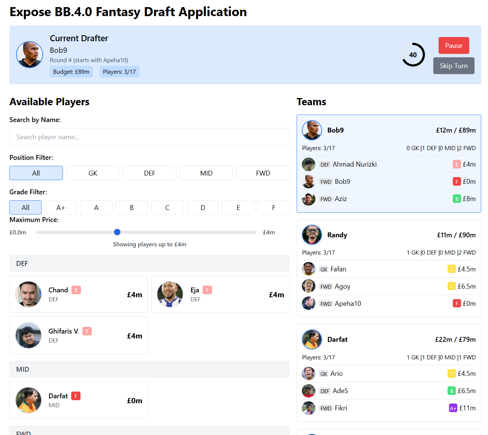

# Fantasy Draft Application

## Overview
The Fantasy Draft Application is a web-based platform that allows users to simulate a fantasy sports draft. Users can create teams, select players, and manage their budgets while adhering to specific position limits. The application provides a user-friendly interface for managing drafts, viewing player statistics, and tracking team compositions.



App : [https://expose-bb4-fantasy-draft-d1mny5ea4-darfats-projects.vercel.app/](https://expose-bb4-fantasy-draft-d1mny5ea4-darfats-projects.vercel.app/)

## Tech Stack
This application is built using the following technologies:
- **React**: A JavaScript library for building user interfaces.
- **TypeScript**: A superset of JavaScript that adds static types, enhancing code quality and maintainability.
- **Tailwind CSS**: A utility-first CSS framework for styling the application.
- **Papa Parse**: A powerful library for parsing CSV files, used to load player data.
- **Vercel**: A platform for deploying frontend applications with ease.

## Features
- User authentication and management
- Player selection with position limits
- Budget management for each team
- Draft history tracking
- Responsive design for mobile and desktop views

## Getting Started

### Prerequisites
Make sure you have the following installed:
- Node.js (version 14 or higher)
- npm (Node package manager)

### Running the Application
1. Clone the repository:
   ```bash
   git clone https://github.com/yourusername/fantasy-draft-app.git
   cd fantasy-draft-app
   ```

2. Install the dependencies:
   ```bash
   npm install
   ```

3. Start the development server:
   ```bash
   npm start
   ```
   Open [http://localhost:3000](http://localhost:3000) in your browser to view the application.

### Building for Production
To create a production build of the application, run:
```bash
npm run build
```
This will generate a `build` folder containing the optimized application.

## Deploying to Vercel
To deploy the application to Vercel, follow these steps:

1. Make sure you have a Vercel account. If you don't have one, sign up at [Vercel](https://vercel.com/).
2. Install the Vercel CLI globally:
   ```bash
   npm install -g vercel
   ```

3. In the root of your project directory, run:
   ```bash
   vercel
   ```
   Follow the prompts to link your project to your Vercel account and deploy it.

4. After deployment, Vercel will provide you with a URL where your application is hosted.

## Contributing
Contributions are welcome! If you would like to contribute to this project, please follow these steps:

1. Fork the repository.
2. Create a new branch for your feature or bug fix:
   ```bash
   git checkout -b feature/YourFeatureName
   ```
3. Make your changes and commit them:
   ```bash
   git commit -m "Add your message here"
   ```
4. Push your changes to your forked repository:
   ```bash
   git push origin feature/YourFeatureName
   ```
5. Create a pull request to the main repository.

## License
This project is licensed under the MIT License. See the [LICENSE](LICENSE) file for details.
